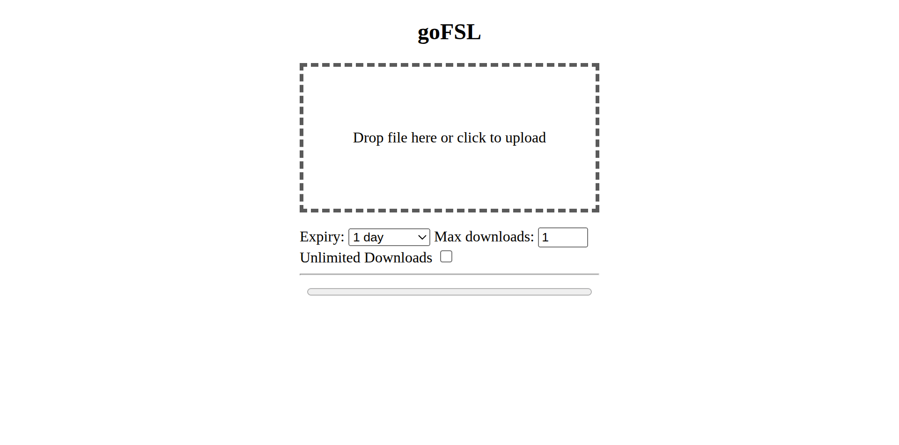
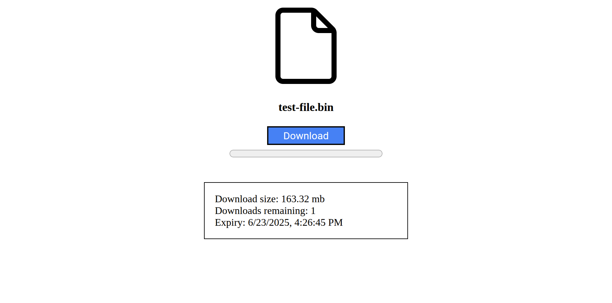

# goFSL

- End-to-end encrypted file hosting using **AES-GCM**
- File metadata encryption
- Supports large files (does not load files into memory)
- Optional authentication for file upload with multiple users
- Optional file expiry and download limit

| Upload Page                 | Download page               |
|-----------------------------|-----------------------------|
|  |  |

## Quickstart with docker
```shell
docker run -d \
  --name goFSL \
  --restart always \
  -p 8080:8080 \
  -v "$(pwd)/data:/data" \
  ghcr.io/kioubit/gofsl:latest
```
Optional example config file: [config.toml](docs/example-config.toml) (to be placed in the data directory)
